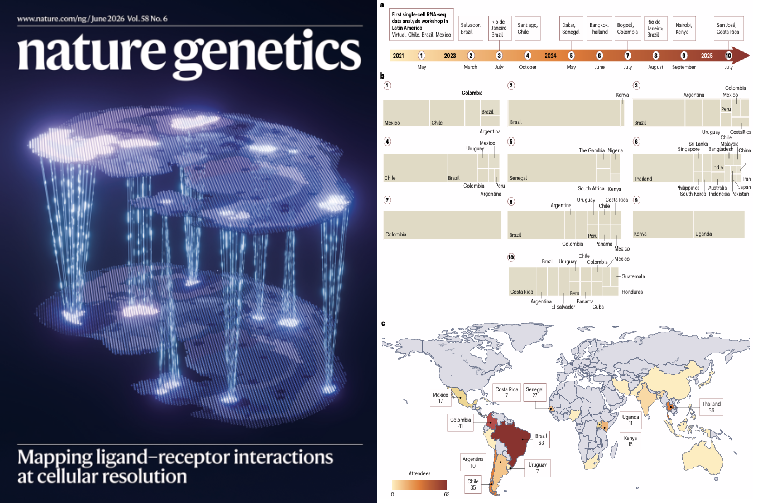
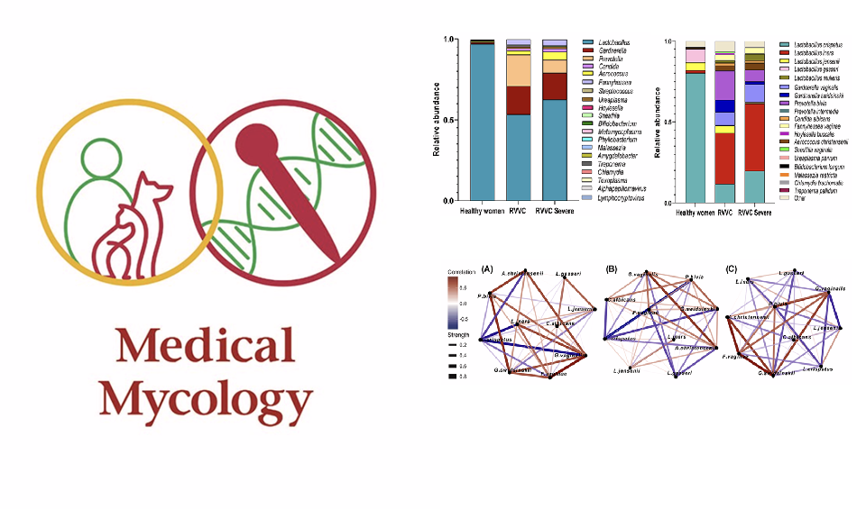

## Selected Publications

[`The Single Cell Notebooks for inclusive and accessible training in single-cell and spatial omics`](https://www.nature.com/articles/s41588-026-02584-0)  
*Adolfo Rojas-Hidalgo, Raúl Arias-Carrasco, Joyce Karoline Silva, Erick Armingol, Sebastián Urquiza-Zurich, Bruno Vinagre, Cesar A. Prada-Medina, 
Sergio Triana, Daniela D. Russo, Diego Pérez-Stuardo, Emiliano Vicencio, Gerardo Muñoz, Cristóvão Antunes de Lanna, Leandro Santos, Gabriela Rapozo, 
Natalia Tavares, Andrés Moreno-Estrada, John Randell, Patricia Severino, Ricardo Khouri, Orr Ashenberg, Alex K. Shalek, Mariana Boroni, 
Yesid Cuesta-Astroz, Benilton S. Carvalho & Vinicius Maracaja-Coutinho*  
***Nature Genetics***

[{width=300px}](https://www.nature.com/articles/s41588-026-02584-0)

[`Characterization of the vaginal microbiome and its metabolic potential in Colombian patients with recurrent vulvovaginal candidiasis`](https://academic.oup.com/mmy/article/64/4/myag026/8540286)  
*Jeiser Marcelo Consuegra-Asprilla, Yesid Cuesta-Astroz, Ángel González* (2026)  
***Medical Mycology***

[{width=350px}](https://academic.oup.com/mmy/article/64/4/myag026/8540286)

---

## All Publications 

### [2026]{style="color: #4169E1;"}

2. [`Insights, opportunities, and challenges provided by large cell atlases`](https://link.springer.com/article/10.1186/s13059-025-03771-8)
*Martin Hemberg, Federico Marini, Shila Ghazanfar, Ahmad Al Ajami, Najla Abassi, Benedict Anchang, Bérénice A Benayoun, Yue Cao, Ken Chen, 
Yesid Cuesta-Astroz, Zachary DeBruine, Calliope A Dendrou, Iwijn De Vlaminck, Katharina Imkeller, Ilya Korsunsky, Alex R Lederer, Jessica Jingyi Li, 
Pieter Meysman, Clint L Miller, Kerry A Mullan, Uwe Ohler, Pratibha Panwar, Nikolaos Patikas, Jonas Schuck, Jacqueline HY Siu, Timothy J Triche Jr, 
Alex Tsankov, Sander W van der Laan, Masanao Yajima, Jean Yang, Fabio Zanini, Ivana Jelic* (2026)  
***Genome Biology***