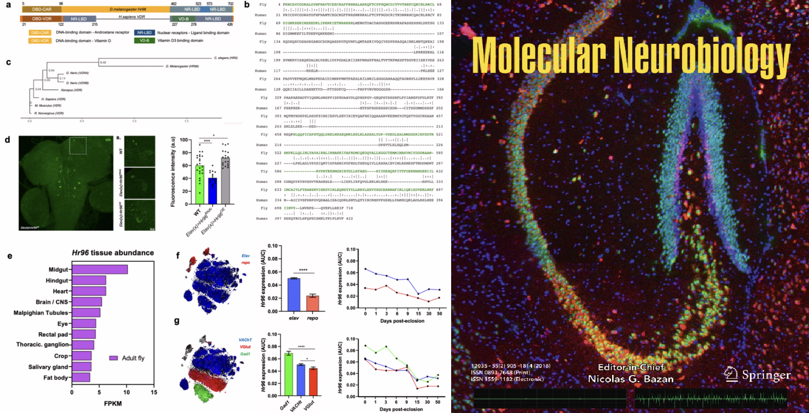
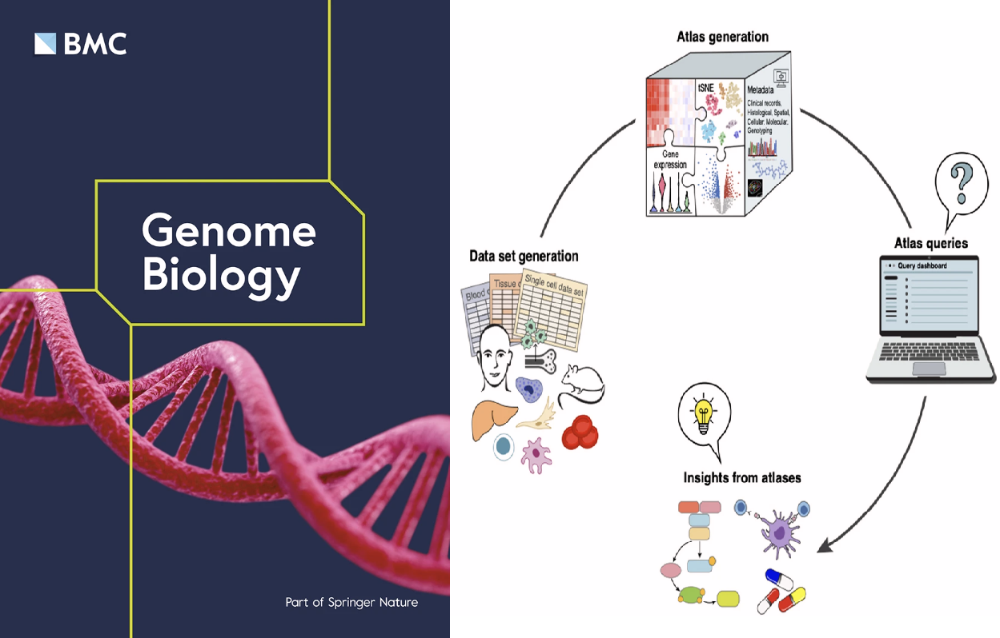
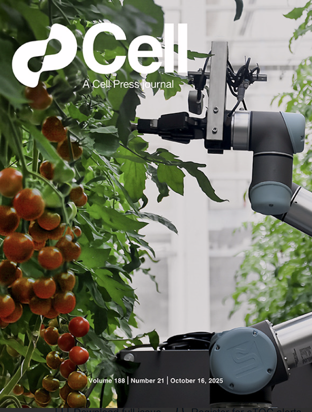

## Selected Publications

[`The Single Cell Notebooks for inclusive and accessible training in single-cell and spatial omics`](https://www.nature.com/articles/s41588-026-02584-0)  
*Adolfo Rojas-Hidalgo, Raúl Arias-Carrasco, Joyce Karoline Silva, Erick Armingol, Sebastián Urquiza-Zurich, Bruno Vinagre, Cesar A. Prada-Medina, 
Sergio Triana, Daniela D. Russo, Diego Pérez-Stuardo, Emiliano Vicencio, Gerardo Muñoz, Cristóvão Antunes de Lanna, Leandro Santos, Gabriela Rapozo, 
Natalia Tavares, Andrés Moreno-Estrada, John Randell, Patricia Severino, Ricardo Khouri, Orr Ashenberg, Alex K. Shalek, Mariana Boroni, 
Yesid Cuesta-Astroz, Benilton S. Carvalho & Vinicius Maracaja-Coutinho* (2026)  
***Nature Genetics***

[{width=300px}](https://www.nature.com/articles/s41588-026-02584-0)

---

[`Characterization of the vaginal microbiome and its metabolic potential in Colombian patients with recurrent vulvovaginal candidiasis`](https://academic.oup.com/mmy/article/64/4/myag026/8540286)  
*Jeiser Marcelo Consuegra-Asprilla, Yesid Cuesta-Astroz, Ángel González* (2026)  
***Medical Mycology***

[{width=350px}](https://academic.oup.com/mmy/article/64/4/myag026/8540286)

---

[`The Vitamin D Receptor Ortholog Hr96 Modulates Neuronal and Mitochondrial Dynamics in a Drosophila Model of Alzheimer’s Disease`](https://link.springer.com/article/10.1007/s12035-025-05502-3)  
*Guilherme Gischkow Rucatti, Francisco Muñoz-Carvajal, Nicole Sanhueza, Sebastian Oyarce-Pezoa, Yesid Cuesta-Astroz, Leandro Murgas, Melissa Caru-Ruiz, Alberto J.M. Martin, Melissa Calegaro-Nassif, Carol D. SanMartín & Mario Sanhueza* (2026)  
***Molecular Neurobiology***

[{width=350px}](https://link.springer.com/article/10.1007/s12035-025-05502-3)

---

[`Insights, opportunities, and challenges provided by large cell atlases`](https://link.springer.com/article/10.1186/s13059-025-03771-8)
*Martin Hemberg, Federico Marini, Shila Ghazanfar, Ahmad Al Ajami, Najla Abassi, Benedict Anchang, Bérénice A Benayoun, Yue Cao, Ken Chen, 
Yesid Cuesta-Astroz, Zachary DeBruine, Calliope A Dendrou, Iwijn De Vlaminck, Katharina Imkeller, Ilya Korsunsky, Alex R Lederer, Jessica Jingyi Li, 
Pieter Meysman, Clint L Miller, Kerry A Mullan, Uwe Ohler, Pratibha Panwar, Nikolaos Patikas, Jonas Schuck, Jacqueline HY Siu, Timothy J Triche Jr, 
Alex Tsankov, Sander W van der Laan, Masanao Yajima, Jean Yang, Fabio Zanini, Ivana Jelic* (2025)  
***Genome Biology***

[{width=350px}](https://link.springer.com/article/10.1186/s13059-025-03771-8)

---

[`Exploring Latin America one cell at a time`](https://www.cell.com/cell/abstract/S0092-8674(25)01081-5)
*Patricia A. Possik ∙ David J. Adams ∙ Flavia C. Aguiar ∙ Tamires Caixeta Alves ∙ Fabíola S. Alves-Hanna ∙
 Carlos Mario Restrepo Arboleda ∙ Erick Armingol ∙ Liã Bárbara Arruda ∙ Yesid Cuesta Astroz ∙ Jacqueline M. Boccacino ∙ Danielle C. Bonfim ∙ Juan F. Calderon ∙ Alexis Germán Murillo Carrasco ∙ Danielle G. Carvalho ∙ Benilton S. Carvalho13 ∙ Paulo Vinícius Sanches Daltro de Carvalho ∙ Alex Castro ∙ Lia Chappell ∙ Ricardo Chinchilla-Monge ∙ Daniela Di Bella ∙ Sandra Martha Gomes Dias ∙ Rafaela Fagundes ∙ Marina L. Fernández ∙ Bianca Braga Frade ∙ Federico J. Garde ∙ Hugo Gonzalez ∙ Gabriela Rapozo Guimarães ∙ Lucas Inchausti ∙ Edith Kordon ∙ Laura Leaden ∙ Rafael S. Lima ∙ Alvaro Lladser ∙ Julieth López-Castiblanco ∙ Isabela Malta ∙ Vinicius Maracaja-Coutinho ∙ Domenica Marchese ∙ Alice Matimba ∙ Andres Moreno-Estrada ∙ Marcelo A. Mori ∙ Helder Nakaya ∙ Silvana Pereyra ∙ Yulye Jessica Romo Ramos ∙ Natalia Rego ∙ Carla Daniela Robles-Espinoza ∙ Adolfo Rojas-Hidalgo ∙ Maria Natalia Rubinsztain ∙ Leandro Santos ∙ Anita Scoones ∙ Patricia Severino ∙ Annie Cristhine M. Sousa-Squiavinato ∙ Lucia Spangenberg ∙ Ana Victoria Suescún ∙ Nayara Gusmão Tessarollo ∙ Martha Estefania Vázquez-Cruz ∙ Ma’n H. Zawati ∙ Joao P.B. Viola ∙ Mariana Boron* (2025)  
***Genome Biology***

[{width=350px}](https://www.cell.com/cell/abstract/S0092-8674(25)01081-5)

## All Publications 

### [2026]{style="color: #4169E1;"}

2. [`Whole-Genome Sequencing Analysis Revealed High Genomic Variability, Recombination Events and Mobile Genetic Elements in Streptococcus uberis Strains Isolated from Bovine Mastitis in Colombian Dairy Herds
`](https://www.mdpi.com/2079-6382/14/3/297)
*Paola A Rios Agudelo, Julián Reyes Vélez, Martha Olivera Angel, Adam M Blanchard, Yesid Cuesta Astroz, Arley Caraballo Guzmán, Giovanny Torres Lindarte* (2025)  
***Antibiotics***
3. [`AlphaFold2 and AlphaFold3 leads to significantly different results in human-parasite interaction prediction`](https://www.biorxiv.org/content/10.1101/2024.09.19.613643v3.abstract)
*Burcu Ozden, Buse Şahin, Ezgi Karaca* (2024)  
***bioRxiv***