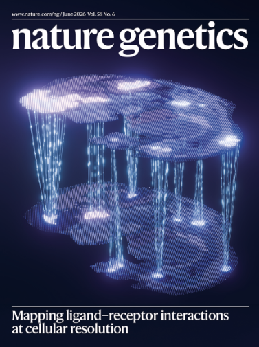
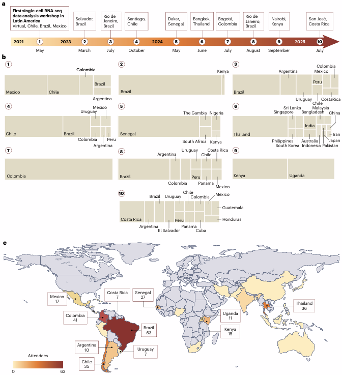

## Selected Publications

[`The Single Cell Notebooks for inclusive and accessible training in single-cell and spatial omics`](https://www.nature.com/articles/s41588-026-02584-0)  
Adolfo Rojas-Hidalgo, Raúl Arias-Carrasco, Joyce Karoline Silva, Erick Armingol, Sebastián Urquiza-Zurich, Bruno Vinagre, Cesar A. Prada-Medina, 
Sergio Triana, Daniela D. Russo, Diego Pérez-Stuardo, Emiliano Vicencio, Gerardo Muñoz, Cristóvão Antunes de Lanna, Leandro Santos, Gabriela Rapozo, 
Natalia Tavares, Andrés Moreno-Estrada, John Randell, Patricia Severino, Ricardo Khouri, Orr Ashenberg, Alex K. Shalek, Mariana Boroni, 
Yesid Cuesta-Astroz, Benilton S. Carvalho & Vinicius Maracaja-Coutinho  
***Nature Genetics***

::: {layout-ncol=2}
[{width=180px}](https://www.nature.com/articles/s41588-026-02584-0)

[{width=180px}](https://www.nature.com/articles/s41588-026-02584-0)
:::

---

## All Publications 

### [2026]{style="color: #4169E1;"}

42. [`Insights, opportunities, and challenges provided by large cell atlases`](https://link.springer.com/article/10.1186/s13059-025-03771-8)
Martin Hemberg1,2*†, Federico Marini3,4*†, Shila Ghazanfar5,6,7*†, Ahmad Al Ajami8,9,10, Najla Abassi3,4, 
Benedict Anchang11, Bérénice A. Benayoun12,13, Yue Cao5,6,7,14, Ken Chen15, Yesid Cuesta-Astroz16,17, 
Zachary DeBruine18, Calliope A. Dendrou19, Iwijn De Vlaminck20, Katharina Imkeller8,9,10, Ilya Korsunsky2,21,22, 
Alex R. Lederer23, Jessica Jingyi Li24,35, Pieter Meysman25, Clint L. Miller26, Kerry A. Mullan25, Uwe Ohler27, 
Pratibha Panwar5,6,7, Nikolaos Patikas1,2, Jonas Schuck8,9,10, Jacqueline H. Y. Siu19, Timothy J. Triche Jr.28,29, 
Alex Tsankov30, Sander W. van der Laan26,31, Masanao Yajima32, Jean Yang5,6,7,14, Fabio Zanini33 and Ivana Jelic34*(2026)  
***Genome Biology***