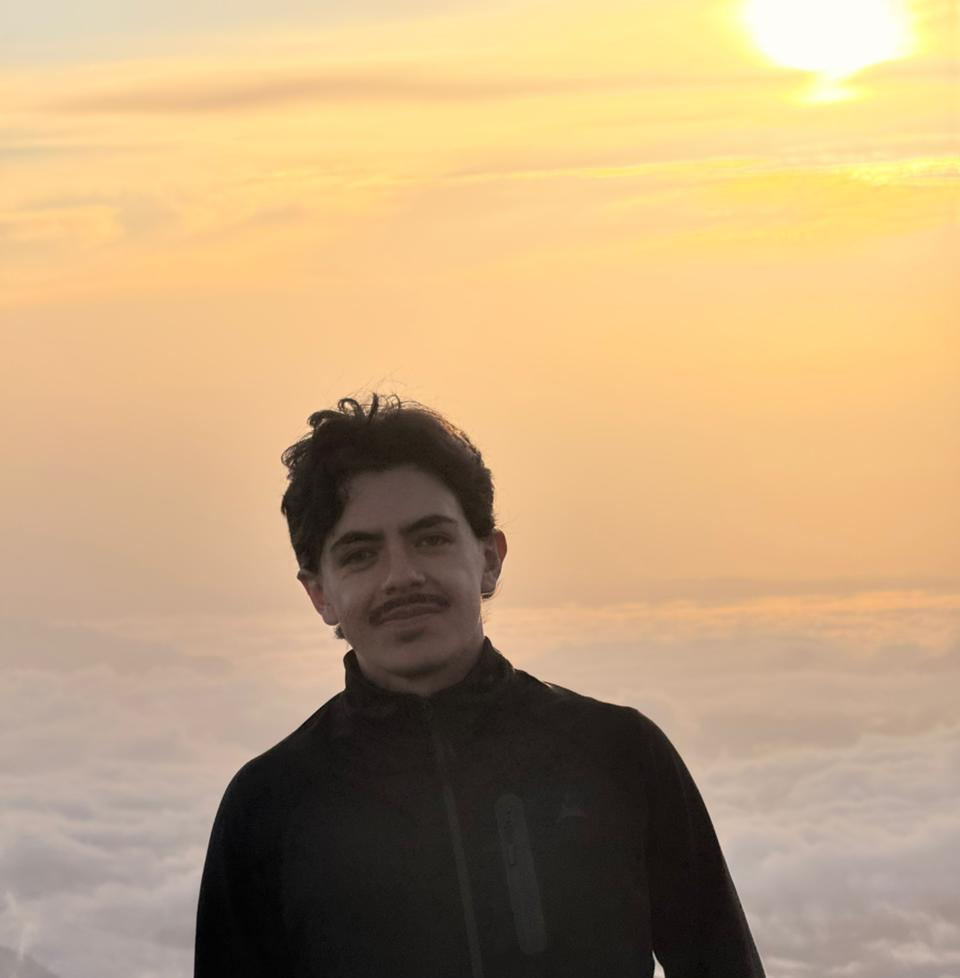

## Principal Investigator

```{=html}
<div style="display: flex; align-items: center; gap: 20px; margin-bottom: 2rem;">
  
  <div>
    <p style="font-size: 16px; font-weight: 500; margin: 0;">Yesid Cuesta Astroz</p>
    <p style="font-size: 13px; color: #666; margin: 4px 0;">Assistant Professor</p>
    <p style="font-size: 13px; color: #666; margin: 0;">School of Microbiology - Universidad de Antioquia</p>
  </div>
</div>
```

---

## Students

```{=html}
<div style="display: grid; grid-template-columns: repeat(auto-fit, minmax(200px, 1fr)); gap: 16px;">

  <div style="display: flex; flex-direction: column; align-items: center; text-align: center; padding: 1.25rem; background: #f9f9f9; border: 0.5px solid #ddd; border-radius: 12px;">
    
    <p style="font-size: 14px; font-weight: 500; margin: 0;">Juan Esteban Vargas</p>
    <p style="font-size: 12px; color: #666; margin: 4px 0;">Undergraduate Student</p>
    <p style="font-size: 12px; color: #666; margin: 4px 0;">juan.vargasg1@udea.edu.co</p>
  </div>

  <div style="display: flex; flex-direction: column; align-items: center; text-align: center; padding: 1.25rem; background: #f9f9f9; border: 0.5px solid #ddd; border-radius: 12px;">
    <p style="font-size: 14px; font-weight: 500; margin: 0;">Juan Pablo Anaya</p>
    <p style="font-size: 12px; color: #666; margin: 4px 0;">Undergraduate Student</p>
    <p style="font-size: 12px; color: #666; margin: 4px 0;">juanpablovillademizar@gmail.com</p>
  </div>

  <div style="display: flex; flex-direction: column; align-items: center; text-align: center; padding: 1.25rem; background: #f9f9f9; border: 0.5px solid #ddd; border-radius: 12px;">
    <p style="font-size: 14px; font-weight: 500; margin: 0;">Juan Jose Velasco</p>
    <p style="font-size: 12px; color: #666; margin: 4px 0;">Master Student</p>
    <p style="font-size: 12px; color: #666; margin: 4px 0;">jjose.velasco@udea.edu.co</p>
  </div>

  <div style="display: flex; flex-direction: column; align-items: center; text-align: center; padding: 1.25rem; background: #f9f9f9; border: 0.5px solid #ddd; border-radius: 12px;">
    <p style="font-size: 14px; font-weight: 500; margin: 0;">Nataly</p>
    <p style="font-size: 12px; color: #666; margin: 4px 0;">Undergraduate Student</p>
    <p style="font-size: 12px; color: #666; margin: 4px 0;">email</p>
  </div>

  <div style="display: flex; flex-direction: column; align-items: center; text-align: center; padding: 1.25rem; background: #f9f9f9; border: 0.5px solid #ddd; border-radius: 12px;">
    <p style="font-size: 14px; font-weight: 500; margin: 0;">Camilo</p>
    <p style="font-size: 12px; color: #666; margin: 4px 0;">Undergraduate Student</p>
    <p style="font-size: 12px; color: #666; margin: 4px 0;">email</p>
  </div>

</div>
```